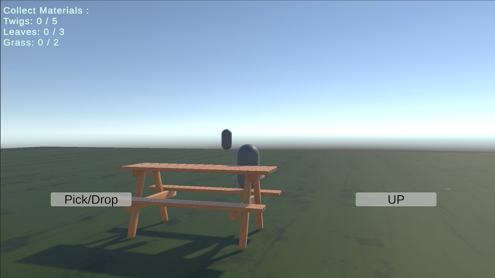

# 🧠 Emotion-Aware Companion System

> A Unity-based adaptive companion that responds to player behavior using rule-based logic.

---

## 🎥 Gameplay

  

---

## 📸 Preview

  

---

## 🧠 What I Built

* Behavior-based player state detection  
* Companion AI using Finite State Machine (FSM)  
* Dynamic guidance system  
* Session-based response system  

---

## 🚀 Features

* Adaptive companion behavior  
* Context-based player interaction  
* Progressive guidance system  

---

## ⚙️ Tech Stack

  

---

## ▶️ How to Run

1. Clone repository  
2. Open in Unity  
3. Press Play  

---
